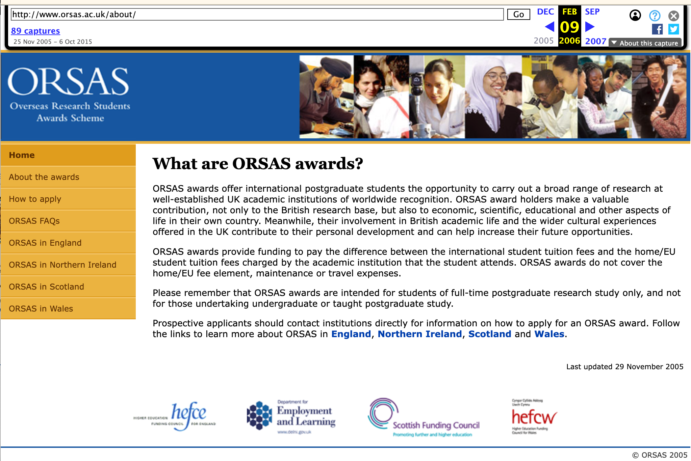
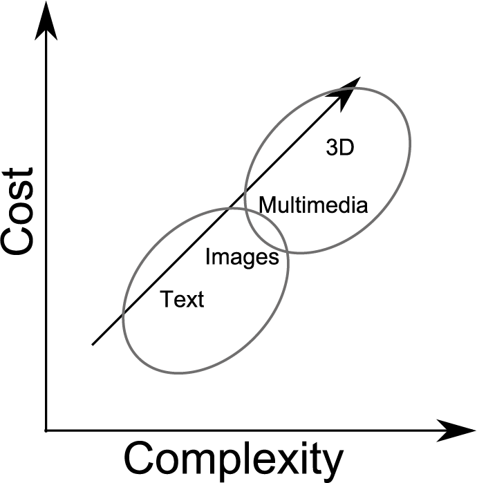
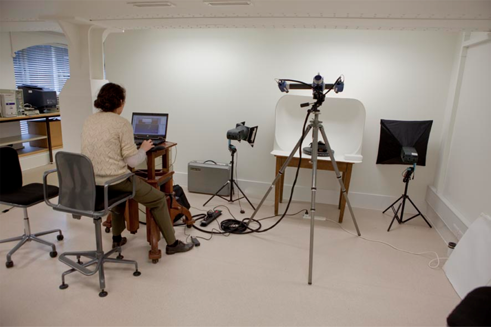

<!-- ******************************************************************-->
<!-- ******************************************************************-->
<!-- *******************************Introduction*****************************-->
<!-- ******************************************************************-->
<!-- ******************************************************************-->

# Agenda

- [Context and bias](#context-and-bias)
- [The quest for data](#the-quest-for-data)
- [Data-driven approaches](#data-driven-approaches)
- [The Artificial-Intelligence (AI) hype](#the-artificial-intelligence-hype)
- [Metrics and Impact](#metrics-and-impact)

:::: notes
This talk traces the motivations, questions, and continuous evolution of my research, as well as the wider research landscape on digital innovation. Through digital innovation, my research aims to uncover the
stories of material culture and the people, both past and present,
who created and interacted with these objects and environments.
Their narratives, and what they tell us about being human, are a constant focus of the research.

The talk is organised across three main topics, each aligned with a decade of research. I will begin by outlining my background and context. Next, I will trace the motivations, questions, and evolution of my research, as well as the wider research landscape on digital innovation.

Secondly, I will explore the big push for digitisation in the 2000s, particularly across the Galleries, Libraries, Archives and Museums (or GLAM) sectors.

Following this, I will discuss the infrastructures and data-driven approaches developed to organise, enable, and open access to data.

I would finish with the rise of Artificial Intelligence and explore its role in trawling large amounts of data.

Through these sections, the talk explores how digital technologies, especially visual technologies, have transformed how we document and preserve culture. They have also changed who can access it, how we engage with it, and the questions we must ask about ownership, representation, and sustainability.
::::

<!-- ******************************************************************-->
<!-- ******************************************************************-->
<!-- *******************************Context and Bias*****************************-->
<!-- ******************************************************************-->
<!-- ******************************************************************-->

# Context and Bias
:::::: {.columns}
::: {.column}
- Background: Computer Science
- Interest and motivation
- Use-inspired Basic Research

:::
::: {.column}

:::
::::::

:::: notes
After completing a degree in Computer Systems Engineering in Mexico in 99, I arrived in the UK in 2001, supported by a scholarship from the Overseas Research Students Awards Scheme (ORSAS), to begin my PhD at the University of Wolverhampton.
Being away from my country for the first time during my doctoral studies renewed my long-term interest in its culture and history, a subject I had greatly enjoyed during my schooling days.

At the time, my research involved developing digital innovations
to support the documentation of industrial processes for plastic-injection moulded products.
This involved exploring technologies such as web platforms, collaborative technologies 
and 3D formats to represent content.
::::

# {background-image="images/Mexico.png"}

::: {.notes}

Just before finishing my PhD, 
Heritage was around difficult to access the site, visitors must have an impact on the state of preservation of the site, interpretation could be improved.
Computational technologies offered:
  - Enable to record, share and improve the visualization of information 
It became obvious the potential of bringing together the disciplines of computing and cultural heritage

::::
<!-- ******************************************************************-->
<!-- ******************************************************************-->
<!-- *******************************Part 1*****************************-->
<!-- *****The quest for data: more data better stories/use*****-->
<!-- ******************************************************************-->
# The Quest for Data 
## Post museum

## Audience's experiences
## Interaction between visitor’s contexts (Falk and Dierking 1992):
- Personal
- Social
- Physical

# How can digital technologies contribute to enrich these experiences?

# Digitisation of material culture

# {background-image="images/publicsculptures0.png"}

# {background-image="images/publicsculptures1.png"}

# {background-image="images/publiccontributions.png"}

# Costs

# Grand Challenges

## To enhance data capture, preservation and scholarship in cultural heritage
## To bring history to life for the citizen
- Digital reconstruction
- Story telling
- Visitor experiences
- Internet, mobile, digital, virtual reality applications

# 3D scanning

## Records the shape of a real-world object, person or environment. 

# 3D model: digital surrogate

# Workflows for developing interactive experiences
## Digital artefact
## Digital/physical transformations
## Digital artifact
## Physical artifact

# Complexity of content

::::
:::::: {.columns}
::: {.column}
Content of the left column.
:::
::: {.column}
{#id .class height=5px}
:::
::::::

# Digitisation of content

:::::: {.columns}
::: {.column}
Content of the left column.
:::
::: {.column}

:::
::::::

# Audiences

# 3D technologies for audiences in a museum gallery
## Physical reconstructions of Sussex ancestors
## Tactile replicas of archaeological artefacts
## Puzzle-based tactile experience

# Immersive Environments

![&copy; [@9b3042bee3474ac1ae615d711196c840]](images/AvatarsEPOCH.png )

[Back to agenda](#agenda)

<!-- ******************************************************************-->
<!-- ******************************************************************-->
<!-- *******************************Part 2*****************************-->
<!-- **Algorithmic ways to understand/organise data and approaches*******-->
<!-- ******************************************************************-->

# Data-Driven Approaches

# 3D documentation and semantic analysis of architectural heritage 

## Semantic analysis

<!-- ******************************************************************-->
<!-- ******************************************************************-->
<!-- *******************************Part 3*****************************-->
<!-- **Looking at the future: AI role in data-driven approaches*******-->
<!-- ******************************************************************-->
# The Artificial Intelligence Hype

<!-- ******************************************************************-->
<!-- ******************************************************************-->
<!-- *******************************Part 4*****************************-->
<!-- *************************Metrics and Impact**********************-->
<!-- ******************************************************************-->
# Metrics and Impact

# Acknowledgments

D. Arnold, O. Abdel Barr, A. Aboulfadl, N. Ali, G. Aitken, A. Al-Ashaab, F. Alves de Oliveira, L. Armstrong, X. Aure, J.B. Barreau, E. Bell, N. Brownsword, M. Bushnel, D. Boyer, E. Carillo, W. Cash, M. Chikama, M. Danks, A. Day, A. Delaney, L. Dibble, S. Dixon, M. Doerr, L. Garnier, R. Gaugne, C. Georgis, J. Glauert, M. Goodchild, A. Grantham, M. Griffin, S. Haegler, R. Haynes, M. Hedges, K. Howland, Y. Huang, L. Isaksen, N. Jakeman, V. Jennings, R. Kadobayashi, J. Kaminski, D. Kanellou, E. Kartaki, R. Laycock, Y. Liu, N. Magnenat-Thalmann, R. Marroquim, R. Martin, J. McLoughlin, A. Medeiros, A. Molina, D. Morris, S. Pena Serna, L. Pemberton, M. Penn, M. Proesmans, R. Pillay, D. Pitzalis, S. Sakkout, A. Salah, M. Samaroudi, B. Schneider, R. Scopigno, N. Sharara, S. Shimojo, M. Shepard, E. Silverton, J. Smythe, R. Song, J. Stevenson, A. Stork, Z. Sujon, N. Theophane, M. Theodoridou, A. Trujillo-Vazquez, T. Weyrich, M. Wynne, J. Winchester, J. Winckler, L. Wieneke, L. Yu-Kun, K. Zumkley

:::: notes
I would like to make a special mention of my husband and children, whose unconditional support means more than words can express. 
They provide me with a life beyond research — one that gives everything else its proper meaning and perspective.

# Thank You

## I now introduce name to conclude proceedings Prof Imran Rafiq

::::
# References

::: {#refs}
:::
