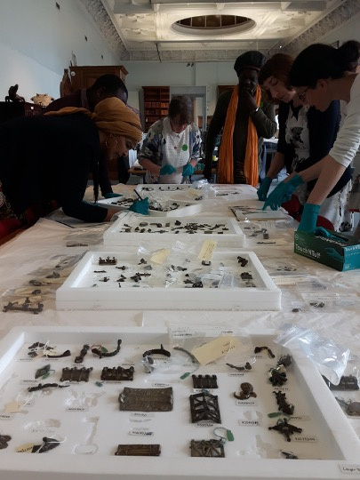
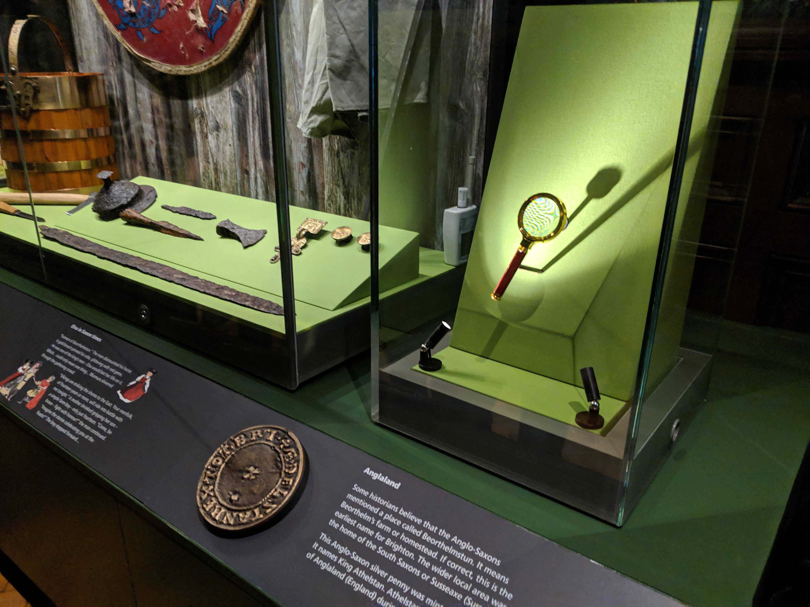
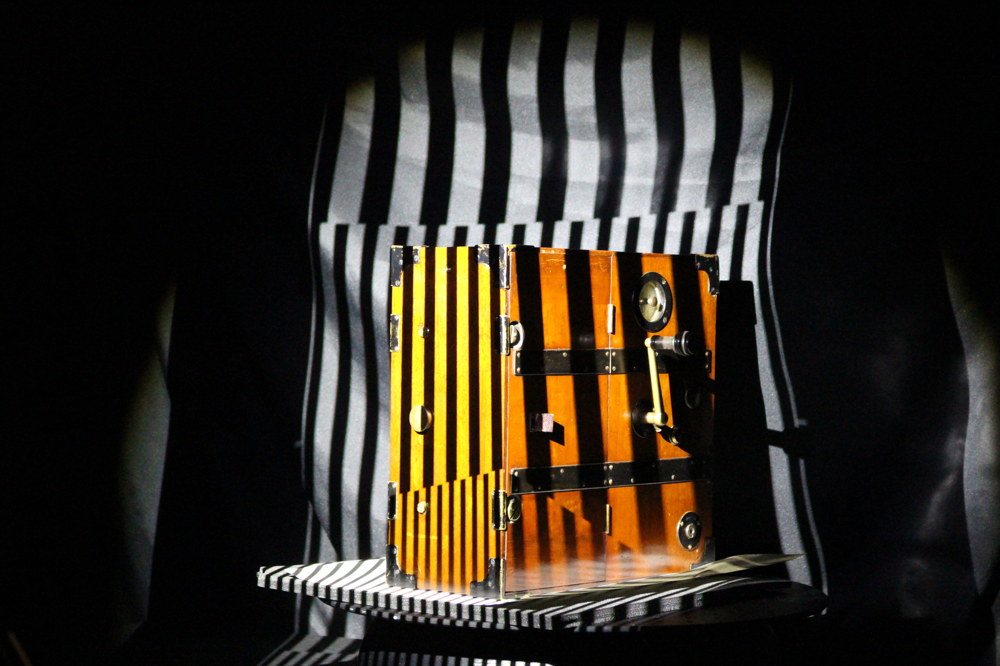
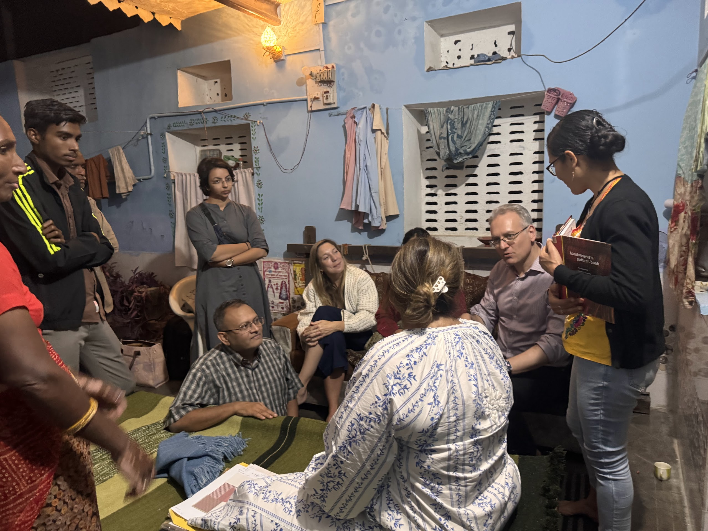

<!-- ******************************************************************-->
<!-- ******************************************************************-->
<!-- *******************************Introduction*****************************-->
<!-- ******************************************************************-->
<!-- ******************************************************************-->

# Agenda

- [Context and bias](#context-and-bias)
- [The quest for data](#the-quest-for-data)
- [Data-driven approaches](#data-driven-approaches)
- [Future digital infrastructures](#future-digital-infrastructures)

:::: notes
This talk traces the motivations, questions, and continuous evolution of my research, as well as the wider research landscape on digital innovation. Through digital innovation, my research aims to uncover the
stories of material culture and the people, both past and present,
who created and interacted with these objects and environments.
Their narratives, and what they tell us about being human, are a constant focus of the research.

The talk is organised across three main topics, each aligned with a decade of research. I will begin by outlining my background and context. Next, I will trace the motivations, questions, and evolution of my research, as well as the wider research landscape on digital innovation.

Secondly, I will explore the big push for digitisation in the 2000s, particularly across the Galleries, Libraries, Archives and Museums (or GLAM) sectors.

Following this, I will discuss the infrastructures and data-driven approaches developed to organise, enable, and open access to data.

I would finish with the rise of Artificial Intelligence and explore future ways to support communities and organisations leverage their data in ways which are ethical, equitable and sustainable.

Through these sections, the talk explores how digital technologies, especially visual technologies, have transformed how we document and preserve culture. They have also changed who can access it, how we engage with it, and the questions we must ask about ownership, representation, and sustainability.
::::

<!-- ******************************************************************-->
<!-- ******************************************************************-->
<!-- *******************************Context and Bias*****************************-->
<!-- ******************************************************************-->
<!-- ******************************************************************-->

# Context and Bias
:::::: {.columns}
::: {.column}
- Background: Computer Science
- Interest and motivation
- Use-inspired Basic Research

:::
::: {.column}

:::
::::::

:::: notes
After completing a degree in Computer Systems Engineering in Mexico in 99, I arrived in the UK in 2001, supported by a scholarship from the Overseas Research Students Awards Scheme (ORSAS), to begin my PhD at the University of Wolverhampton.
Being away from my country for the first time during my doctoral studies renewed my long-term interest in its culture and history, a subject I had greatly enjoyed during my schooling days. History was one of my favourite subjects in middle school. While museums were not so common, Mexico has amazing archaeological sites, many of which I visited. 

At the time, my research involved developing digital innovations to support the documentation of industrial processes for plastic-injection moulded products. This involved exploring technologies such as web platforms, collaborative technologies 
and 3D formats to represent content.

::::

# {background-image="images/mexico.png"}

::: {.notes}

In the final stretch of my PhD, a visit to the archaeological site of Teotihuacan near Mexico City planted the seed for what would become my research career. Teotihuacan is one of the most remarkable ancient cities ever built. 
Located about 30 miles (50 km) northeast of modern-day Mexico City, it was once the largest city in the Americas — and one of the biggest in the entire world.

After researching digital innovations for documenting knowledge, 3D information, and enabling communication through web interfaces, it became clear to me the potential of these technologies to record, share, and improve how visitors understand the history of these sites. It became obvious that there was potential in bringing together the disciplines of computing and cultural heritage. Shortly afterwards, I saw an advert for a researcher at the University of Brighton working on a European Commission-funded project. I joined the University in August 2004.
::::
<!-- ******************************************************************-->
<!-- ******************************************************************-->
<!-- *******************************Part 1*****************************-->
<!-- *****The quest for data: more data better stories/use*****-->
<!-- ******************************************************************-->
# The Quest for Data 

:::::: {.columns}
::: {.column}
### Research challenges:

- To enhance digitisation, preservation and scholarship in cultural heritage
- To support interpretation of cultural heritage
- Building capacity within organisations
- EC-funded Projects: EPOCH ([http://epoch-net.org/](http://epoch-net.org/)), 3D-COFORM Research 
:::
::: {.column}

:::
:::

::: {.notes}
In my early years, I joined two large-European Comission funded projects. 
They both aimed to address technical challenges and the research evolved into various strands: 
(1) creating deployable methods and workflows for digitising CH assets; which provide the basis for 
(2) creating interpretative experiences of CH collections. 
(3) building capacity amongst practitioners 
:::

# Digitisation of Material Culture

:::::: {.columns}
::: {.column}
- Measures data on the shape, colour and other material properties of a objects, people or environments. 
- [Digitisation process](videos/scanning.mp4)
- Results in a digital representation
- Preserves data acquired at the time of digitisation 
:::
::: {.column}
](images/hoard.jpg)
:::
:::

::: {.notes}
I would like to briefly pause to explore the process and the outcome of a digitisation process before continuing.
In the first decade of the 21st century, several forces converged to drive the rapid acceleration of digitisation.
Powerful computers, storage, and servers were cheap enough for organisations of all sizes.
The iPhone and the Android ecosystem also put a networked computer in billions of pockets, and
platforms like Facebook, YouTube, and Twitter showed that user-generated content and network effects could create massive value. 
In essence, more users led to more investment, better technologies and lower costs.

visual digitisation processes record the shape of a real-world object, person or environment. 
At the end of the process, we obtain a 3D model which is a digital representation of the shape of physical artefact.
This model can serve as a digital surrogate so that the original does not need to be manipulated any longer, lowering the chances of damaging it in order to create experiences for visitors. 
The surrogate can also serve for other important purposes for preservation and conservation including preservation of information about the original, monitoring change, etc.

:::

# {background-image="images/video3dcoform.png"}

[Play video](images/handson.mp4)

# Collaborators and Users

:::::: {.columns}
::: {.column}

- GLAMs (Gallery, Libraries, Archives and Museums)
- Audiences
- General public
- Policy makers, funders 
- Digital infrastructure providers
:::

::: {.column}
![3D scanning at the Victoria and Albert museum [@9dc0f3aab41644ef87e8e7915427805f]](images/vamscanning1.png)

:::
:::
::: {.notes}
The driving force behind much of the research was the demand to improve documentation and access to cultural heritage collections and environments that are often fragile and inaccessible. 
Users of this research included Cultural Heritage practitioners and professionals whose moving agendas and priorities often informed the developments. 
Other important stakeholders involved audiences and general public interested in CH.
Also, builders of digital infrastructures, such as systems for Collection Management, Digital Assset Management Systems, Aggregators of content,
on-the-cloud service providers.
:::

---
# Digital Infrastructures
:::::: {.columns}
::: {.column}
*In-house training has the highest start-up costs and incurs the biggest risks if staff move on, however, it has a huge strategic value in terms of flexibility and long-term cost reduction for large numbers of objects. [@9dc0f3aab41644ef87e8e7915427805f]*
:::
::: {.column}

:::
:::
::: notes
During this time, we looked at the effort, opportunities, and risks of building infrastructure to support digitisation. These infrastructures often involve databases and computers that can store, process, and manage digital information and make it accessible via web-based interfaces or mobile apps.
The rise of tech companies during the first decade of this century proved key to the era we live in today. For two decades, there has been a trend of public organisations outsourcing critical functions, including digital infrastructure.

Marietje Schaake, in her book "The Tech Coup: How to Save Democracy from Silicon Valley"
discusses how the coup by tech companies is systemic, and it's often not very visible.
While many governments and public organisations embraced digitisation, the process relied heavily on outsourcing to private companies rather than investing in internal public-sector capabilities and expertise. This outsourcing leads to a loss of knowledge and control over critical services, making future innovation more dependent on private actors, whose profit-driven motives differ from the public interest, thereby weakening government agency and oversight.
:::

# {background-image="images/pmsa.png"}

::: notes
Our research involved looking at communities digitising heritage assets, and we had an  initiative to support the digitisation of public scultpure and monuments in Brighton and Hove. This project ran alongside the Public sculptures of Sussex: The Public Monuments and Sculpture Association National Recording Project by Peter Seddon, Dr Jill Seddon and Dr Anthony McIntosh.
The project used a crowdsourcing approach to produce a public dataset by combining contributions, embedding provenance information and directing the contributions of communities over an entire selection of heritage artefacts in order to create a 3D collection of those arte
facts. This was an approach ArtUK eventually implemented through their Public Sculpture Digitisation (2017–2021) project wil enabled to record over 14,000 public sculptures and monuments.
:::

[Back to agenda](#agenda)

_____
<!-- ******************************************************************-->
<!-- ******************************************************************-->
<!-- *******************************Part 2*****************************-->
<!-- **Algorithmic ways to understand/organise data and approaches*******-->
<!-- ******************************************************************-->

# Data-Driven Approaches

:::: {.columns}
:::: {.column}
## Research Challenges:
- Supporting easy discovery and access to data
- Enhancing data-driven approaches for applications in Cultural Heritage
- EPSRC-funded research: First Grant: Automatic Semantic Analysis of Digital Repositories (2013-2015)

::::
:::: {.column}

::::
::::

::: notes
Inevitably, the wider availability of data leads to further research challenges
As technologies for digitisation start being adopted, the amount of data increases. To enable the creative use of this content, it is necessary to address challenges related to the organisation, management, discovery and easy use of the data.
In 2013, funded by my first EPSRC grant, the research developed what is known as semantic-enrichment approaches for 3D content. The project was developed in collaboration with the Regency Town House in Brighton and Hove, engaging with their plaster moulding collection.
:::

# Semantic Metadata Enrichment

:::: {.columns}
:::: {.column}
- Semantic metadata: information that provides insights into what the data represents
- **Data about the data**
- Post-museum theoretical framework [@falk92]
::::
:::: {.column}

::::
::::

::: notes
*Semantic metadata* is the information that describes the digital surrogate. It can be said that is the Data about the data.
It goes beyond simple labels or technical details to provide insights into what the data actually represents, enabling better understanding, discovery, and interoperability.
Semantic metadata is especially important in fields like data integration, knowledge management, and the Semantic Web, where understanding the context and relationships within and between datasets is essential for meaningful analysis and automation.
Yet, it can be argued that the semantics of objects in cultural heritage are not straightforward, as meaning is negotiated through interactions with artefacts and within sites. For instance, according to the post-museum theoretical framework, meaning during museum visits is created through the interplay of personal, social, and physical contexts.
:::

# Approaches for 3D content

:::: {.columns}
:::: {.column}
- [Manually tagging information](videos/tagg3d.mp4)
- Automating the analysis of the shape to extract semantics [@1cf25fe271474ab28c1eea4cd9e1cfb0]
- Deployed to document knowledge and semantics [Regency ornament mouldings](videos/vlc-record-2016-10-06-07h44m58s-3dsem.mp4) of the Regency Town House 
- Enables grouping [similar shapes](videos/website_3d_model.mp4)

::::
:::: {.column}
![Saliency of 3D mouldings [@1cf25fe271474ab28c1eea4cd9e1cfb0]](images/saliency.png)
::::
::::

:::: notes
The technologies to support tagging data with useful metadata are now widely established
through web interfaces. The involve selecting the areas of 3D models which represent certain information and attaching additional information to the data.
Another approach which was developed is using the concept of saliency.
The research developed analytical method based on shape saliency to improve the automatic classification of the artefact semantic information based on its 3D shape. This method is tested on a
collection of Regency ornament mouldings found in domestic interiors. The content provides a rich dataset on which to explore
issues common to many CH artefacts, such as design styles and decorative ornament
3D saliency, as shape semantic, is a measure of relative importance of different regions of a 3D surface.
:::::

# Artificial-Intelligence (AI) based Approaches

:::: {.columns}
:::: {.column}
## Collaboration with the Design Archives (DA)
- Identify common content patterns in the DA's Design Council Photographic Library
- Automates tagging and grouping similar images [@6f2ed977d74647c88938c59d57808aa6]
- 3D content is still an ongoing challenge

:::::
:::: {.column}

::::
::::

:::: notes
We recently have explored approaches based on training Artificial Intelligence (or AI) models to identify visual data in photographs. Using existing AI models for images, and what is known as unified vision-language understanding, we collaborated with the Design Archives looking at their Photographic Library of the Council of Industrial Design.
Through ongoing digitisation efforts, high-resolution scanned images have been made in the last few years. The digital files are labelled with identifiers available in the physical medium. To this date, $\sim$10,000 photographs of a total of approximately $\sim$100,000 images in physical form and $\sim$10,000 digitised glass plates of a total of $\sim$60,000 plates in physical form have been digitised. 
::::

# {background-image="images/approach.png"}

::: notes
Similar to other visual cultural collections, cataloguing this material is not an easy task, as there are multiple interpretations for its subject classification. The proposed method utilises AI-assisted image classification and unified vision-language understanding, combining visual features with semantic context to generate metadata, can support experts to enrich this material for access. 
The proposed approach involves
1) making the large-scale visual collection is made available via a interoperable framework known as IIIF.
2) Expert labels are generated using an AI-based supervised learning algorithm
for image classification. For this, a Foundation Model (FM) is fine-tuned with an expert-based set of labels.
3) Text-rich captions are generated for the collections, resulting in a set of non-expert labels for each image.
4) The metadata is made available alongside the visual collection. 
:::

# {background-image="images/phdopportunity.png"}

# Creative (Re)Use of Digital Surrogates: Broadening Engagment with CH

:::: {.columns}
:::: {.column}
## Potential for digital surrogate to support (critical) engagement, through:

- Physical encounters
- Interactive experiences
- Multiple context for interpretation (e.g. museum visit, everyday life)
::::
:::: {.column}

::::
::::
::: notes
:::

# Physical Encounters

:::::: {.columns}
::: {.column}
- Focus on gamified interactions with the archaeological artefacts
- Algorithmic design and customisable digital fabrication
- Deployed with the Satdean urn at the Brighton Museum and Art Gallery
:::
::: {.column}

:::
::::

::: notes
The generation of tactile artefacts for the museum was tested with an Iron Age urn which
was found at the edge of a cliff on the south east coastal area of the United Kingdom in 1910.
3D printed replicas of artefacts have been used for a variety of purposes when managing cultural heritage resources. We used replicas along with digital content to support interpretative experiences.
:::
# Fracture Generation Algorithm

:::::: {.columns}
::: {.column}
# Combines two types of geometric representations [@8eb81a287d84409a92b0cdc8187de509]

- Polygonal mesh and Constructive Solid Geometry (CSG).
- Boolean intersection operations.
- Online version: [https://3dpuzzle.chws.brighton.domains/](https://3dpuzzle.chws.brighton.domains/)

:::
::: {.column}

:::
::::::

# Interactive Experiences

::: {.columns}
::: {.column}
# Engages with visual information of an area or location as it might have been in the past.
- Brings history to life for the user
- Illustrates multiple interpretations of the uses of the Satdean urn in the Late Iron Age
:::
::: {.column}
![3D Visualisation of Saltdean area [@17d9c1d2b6b34f33842d4f0e0871f35a]](images/vrcontext.png)
:::
::::::

:::: notes
The best way to study and understand cultural heritage is to experience it in the closest way to the real world as possible. 
Virtual reality experiences allow the user to interact with the digital world in an engaging way.
Typically, the main objectives of Virtual Reality experiences include:
- The visualisation of artefacts and sites along the contexts in
which they were created and used.
- Enhancement of learning, understanding of visitors regarding the past, while providing an interactive experience.
::::

# Creative Interactions

::: {.columns}
::: {.column}
- Engaging communities with everyday connections to objects, sites and events in the urban landscape.
- Piloted with over 250 young people from primary schools in Brighton and Hove.
- Digital outputs using Augumented Reality: [map](videos/exploringthefamiliardigital0.mp4) and [pop up book](videos/exploringthefamiliardigital1.mp4) [@67de57da91fa48eabec0db686832ec96].
:::
::: {.column}
![Activities in local school [@1011453479007]](images/exploringthefamiliar.png)
:::
:::

# Affordabilities of Visual Data

::: {.columns}
::: {.column}

- Multipurpose digital resource
- Data-driven approaches
- Engages diverse audiences
- Benefit from collaborative approaches and interdisciplinarity

[Back to agenda](#agenda)
::::
::: {.column}

::::
::::

:::: notes
- *Multipurpose digital resource*: 3D surrogate can support multiple processes, including research, preservation and interpretation.
- *Data-driven approaches* can offer automation and cost-effective solutions which would not be possible otherwise.
- *Engages diverse audiences*: Enables the development of a wide variety of experiences which appeal to different audiences.
::::

<!-- ******************************************************************-->
<!-- ******************************************************************-->
<!-- *******************************Part 3*****************************-->
<!-- **Looking at the future: Digital Infrastructures*******-->
<!-- ******************************************************************-->
# Future Digital Infrastructures

::: {.columns}
::: {.column}
- Underpins digitisation and deploying technology within organisations
- Requires continuous investment in skills, expertise and hardware/software 
- High-risk if not right
:::
::: {.column}

:::
:::

::: notes
Previously I mentioned that building capacity was a big focus of the research. Almost all projects in which I work involve an element of training, capacity building and knowledge transfer to organisations.

Through this work, the common question is how users can deploy the software, tools, workflows which they learn about.

Without infrastructure there is no digitisation nor engagement with digital surrogates.

Beside skills, a minimum set of infrastructure is required: a PC, a 3D scanner or camera, a server to make the content accessible, expertise and support to mantain this infrastructure.

And getting it wrong there is a high cost!
On Saturday 28 October 2023, a hacker group entered a server at the British Library.
The criminal gang responsible for the attack copied and exfiltrated (illegally removed) some 600GB of files, including personal data of Library users and staff. When it became clear that no ransom would be paid, this data was put up for auction and subsequently dumped on the dark web. 
All their software systems cannot be brought back in their pre-attack form, either because they
are no longer supported by the vendor or because they will not function on the new secure
infrastructure that is currently being rolled out.

This incident illustrate what is at stake to keep infrastructure maintained and protected.

The last decade saw an expansion on the privatisation of infrastructures in the public sector. Increasingly, GLAMS use private infrastructures to host their collections and provide access through API interfaces and websites.

:::

# World-wide Communities: Digitisation of Intangible Practices 

::: {.columns}
::: {.column}
- Community-led digitisation
- Address sustainability challenges
- Brings innovation and equitable futures to communities around the world [@a4bc0d5a7301419abfa607faef7bc7a0]
:::
::: {.column}
![Artisans in historic centre, Cairo [@a4bc0d5a7301419abfa607faef7bc7a0]](images/cairo.jpg)
:::
:::
::: notes
Through the previous project in the craft of ornamental plaster mouldings, I became increasingly interested in documenting the knowledge related to making practices.
The motivation behind it is that artisan communities, which are carriers of intangible practices of craft, increasingly face challenges for their sustainability in an increasingly globalised world. Challenges around competition, regulatory frameworks and access to technologies threatens communities. 
Hence, the potential of this research to support the documentation and dissemination of the intangible heritage of communities across the world is great. 
Yet new approaches and infrastructures which serve the community are required.
Community-led digitisation is key.
Through a research funded by the British Council, we had the opportunity to collaborate with the Egyptian Heritage Rescue Foundation, Cairo to scope research agendas for supporting communities to document their intangible heritage, and enable the digital transformation of their practices.
:::

# Digital Infrastructures for Artisans
::: {.columns}
::: {.column}
- Documenting knowledge with artisans in [historic centre, Cairo](images/igniteegypt.mp4)  funded funded by British Council and UoB Ignite programme
- Developing infrastructures for community-based digitisation with [Rajasthan, India](images/IndiaUKAHRCVideo.mp4) 
- Decentralised infrastructures as alternatives to social-media centralised models 
:::
::: {.column}

:::
:::

# Infrastructure as Code

# Sustainability of content
- Where all this software goes
- Sustainability
- Raise of outsourcing infrastructure

# Soverignity and Investment in Digital Research Infrastructures

- Why are they important 
- Who use them: researchers, DRTPs, 
- What barriers there are: skills and awarness

# What about communities who co-develop research?

- Documentation of their heritage
- Egypt
- India
- Economic perspective

# Future decentralised
- Shared infrastructures
- Community networks
- Governance models

<!-- ******************************************************************-->
<!-- ******************************************************************-->
<!-- *******************************Part 4*****************************-->
<!-- *************************Metrics and Impact**********************-->
<!-- ******************************************************************-->
# Metrics and Impact

# Acknowledgments

D. Arnold, O. Abdel Barr, A. Aboulfadl, N. Ali, G. Aitken, A. Al-Ashaab, F. Alves de Oliveira, L. Armstrong, X. Aure, J.B. Barreau, E. Bell, N. Brownsword, M. Bushnel, D. Boyer, E. Carillo, W. Cash, M. Chikama, M. Danks, A. Day, A. Delaney, L. Dibble, S. Dixon, M. Doerr, L. Garnier, R. Gaugne, C. Georgis, J. Glauert, M. Goodchild, A. Grantham, M. Griffin, S. Haegler, R. Haynes, M. Hedges, K. Howland, Y. Huang, L. Isaksen, N. Jakeman, V. Jennings, R. Kadobayashi, J. Kaminski, D. Kanellou, E. Kartaki, R. Laycock, Y. Liu, N. Magnenat-Thalmann, R. Marroquim, R. Martin, J. McLoughlin, A. Medeiros, A. Molina, D. Morris, S. Pena Serna, L. Pemberton, M. Penn, M. Proesmans, R. Pillay, D. Pitzalis, S. Sakkout, A. Salah, M. Samaroudi, B. Schneider, R. Scopigno, N. Sharara, S. Shimojo, M. Shepard, E. Silverton, J. Smythe, R. Song, J. Stevenson, A. Stork, Z. Sujon, N. Theophane, M. Theodoridou, A. Trujillo-Vazquez, T. Weyrich, M. Wynne, J. Winchester, J. Winckler, L. Wieneke, L. Yu-Kun, K. Zumkley

:::: notes
I would like to make a special mention of my husband and children, whose unconditional support means more than words can express. 
They provide me with a life beyond research — one that gives everything else its proper meaning and perspective.

# Thank You

## I now introduce name to conclude proceedings Prof Imran Rafiq

::::
# References

::: {#refs}
:::
