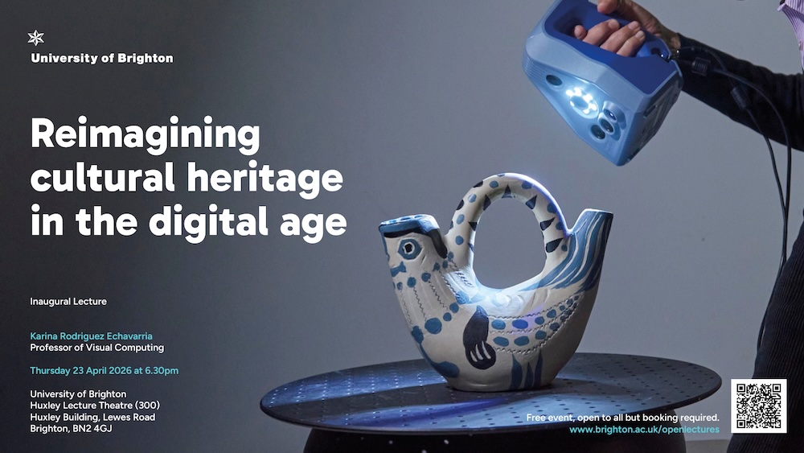

# Reimagining cultural heritage in the digital age



## Presentation for Karina Rodriguez Echavarria's Inaugural lecture

Thursday 23 April 2026, 6.30pm, Huxley Lecture Theatre (300), Moulsecoomb, Brighton UK

*Abstract*
As our lives become increasingly digital, so too does our experience of culture. In this lecture, Professor Karina Rodriguez Echavarria explores how advances in computing are transforming artefacts, historic environments and cultural practices into interactive digital experiences.

These “digital twins” do more than preserve the past. They make heritage accessible beyond physical museums and archives, opening up new possibilities for creativity, education and public engagement. At the same time, they raise pressing questions about ownership, representation and long-term sustainability.

Drawing on interdisciplinary research at the intersection of computing and cultural heritage, Professor Rodriguez Echavarria offers a compelling overview of how technology is reshaping the ways culture is created, shared and valued in the 21st century. 

## Booking Link
[https://www.brighton.ac.uk/research/research-news/films-and-publications/inaugural-lectures/professor-karina-rodriguez-echavarria.aspx](https://www.brighton.ac.uk/research/research-news/films-and-publications/inaugural-lectures/professor-karina-rodriguez-echavarria.aspx)

## About the Presenter
Dr. Karina Rodriguez Echavarria
Professor of Visual Computing in the School of Architecture, Technology and Engineering
Profile: https://research.brighton.ac.uk/en/persons/karina-rodriguez-echavarria/ 


## How to create the slides
The Rmd contains the information for the slides. It uses the R implementation
of markdown. See more: [https://yihui.org/rmarkdown/powerpoint-presentation](https://yihui.org/rmarkdown/powerpoint-presentation)

To run using the R package for Markdown, run the folling in the console
``` {r, include=FALSE}

  rmarkdown::render("2026.karina.inagprof.Rmd") ``

```
